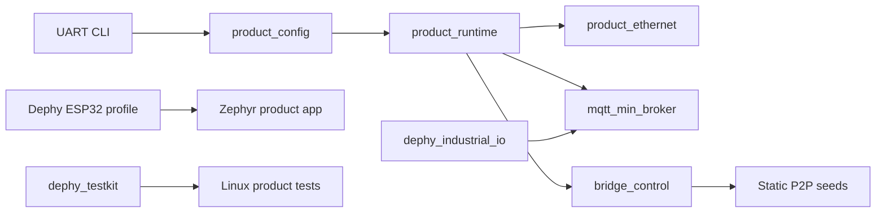
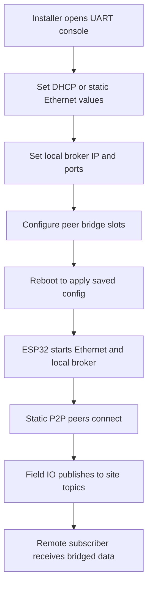

# mqtt_field_bridge_app

Product application for configurable MQTT field bridge deployments.

## Overview

`mqtt_field_bridge_app` composes the pinned Dephy modules into a deployable
ESP32 field bridge product. The current product path is Ethernet-first: the app
brings up W5500 Ethernet, applies saved product configuration, starts the local
MQTT broker, and applies manually configured static P2P bridge peers.

The firmware provisioning path is UART CLI based. The older embedded
provisioning web UI is no longer part of the firmware build path; web-related
Linux helpers are kept only for local test and compatibility work.

## What This Repo Owns

- Product configuration defaults and persistence glue.
- UART CLI menus and commands for device network, local broker, and peer bridge
  settings.
- Ethernet startup and runtime status handling for the product firmware.
- Static-seed MQTT/P2P bridge control using `CONFIG_MQTT_P2P_DYNAMIC=y` and
  `CONFIG_MQTT_P2P_STATIC_SEEDS_ONLY=y`.
- Linux host tests for product config, runtime behavior, CLI, IO bridge glue,
  dependency sync, P2P routing, and stress scenarios.
- Product build composition from pinned dependencies in `deps.json`.

Reusable broker, board, IO, network, config, and CLI behavior belongs in the
module repos. Product builds consume those modules from `deps/`.

## Repository Layout

```text
app/                 Zephyr product application
app/src/             Product C sources and headers
app/prj.conf         Default Ethernet firmware configuration
app/prj_wifi_linux_ap.conf
                     WiFi/Linux AP test-profile overlay
scripts/             Dependency sync, product build, and hardware helpers
tests/linux/         Linux unit, integration, stress, benchmark, and HW tests
docs/                Project notes, validation records, and historical results
deps.json            Pinned dependency versions and build metadata
```

## Quick Start

```sh
git clone git@github.com:judadao/mqtt_field_bridge_app.git
cd mqtt_field_bridge_app

# Fetch pinned dependencies into deps/
./scripts/sync_deps.sh download

# Run fast host validation
make -C tests/linux unit-tests
```

For multi-repo development with sibling checkouts such as `../mqtt_min_broker`
and `../dephy`, use:

```sh
./scripts/sync_deps.sh replace
```

## Dependency Commands

```sh
# Clone/fetch pinned deps into deps/ (default command)
./scripts/sync_deps.sh download

# Initialize Zephyr modules through the pinned Dephy workspace
./scripts/sync_deps.sh init

# Replace deps/ from sibling local checkouts
./scripts/sync_deps.sh replace

# Check whether the pinned broker tag is current
./scripts/sync_deps.sh --check-latest
```

`local-build` runs `replace` and then builds. `external-build` runs `download`,
`init`, and then builds.

## Firmware Build

Build the default Ethernet product firmware:

```sh
./scripts/sync_deps.sh external-build
```

During local module development:

```sh
./scripts/sync_deps.sh local-build
```

The board is read from `deps.json`; the current default is
`esp32_devkitc/esp32/procpu`. The default build uses `app/prj.conf` plus the
Dephy ESP32 slim product config listed in `deps.json`.

The WiFi/Linux AP profile is a test profile, not the default product path:

```sh
./scripts/build_wifi_bridge_product.sh
```

## Linux Tests

```sh
# Unit tests only
make -C tests/linux unit-tests

# Broker/P2P integration scenarios
make -C tests/linux integration-tests

# Reconnect and throughput stress tests
make -C tests/linux stress

# Main local validation entry point via dephy_testkit wrappers
make -C tests/linux test
```

Additional scale, hardware, and benchmark targets are documented in
`tests/linux/README.md`.

## Optional Linux Web Helper

For browser inspection of the compatibility web/config helper:

```sh
./run_linux_web.sh
```

Open `http://127.0.0.1:8080/`. This helper is useful for local Linux checks, but
it is not the primary firmware provisioning path.

## Architecture Flow



## Example Field Flow



## Results And Historical Notes

Detailed load-balance, fallback, and failure-recovery benchmark records live in
`docs/load_balance_throughput_results.md`. Older README material and removed
web/WiFi provisioning notes are kept in `docs/readme_legacy.md` and related
documents for reference.

## Docs

- `tests/linux/README.md`: Linux test inventory, knobs, benchmark commands, and
  hardware-test notes.
- `docs/field_bridge_scenario.md`: field bridge scenario notes.
- `docs/field_validation_checklist.md`: hardware validation checklist.
- `docs/hardware_wifi_validation.md`: WiFi validation notes for test profiles.
- `docs/load_balance_throughput_results.md`: recorded benchmark results.
- `docs/versioning.md`: dependency/version guidance.
- `docs/readme_legacy.md`: previous long README and historical examples.

## Principle

This repo owns product workflow and module composition. If behavior is reusable,
fix it in the module repo first, tag it, then update `deps.json`.

## License

MIT. See `LICENSE` and `NOTICE.md`.
