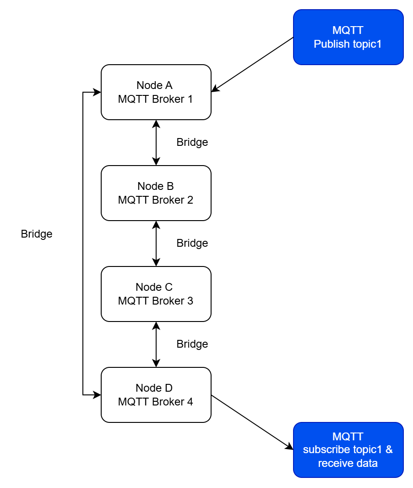
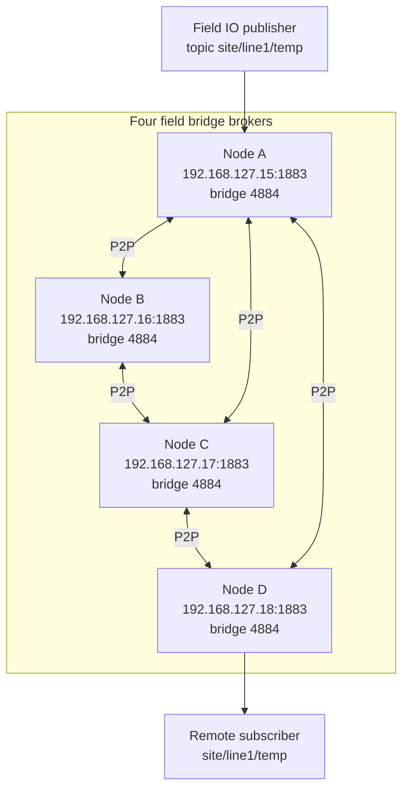
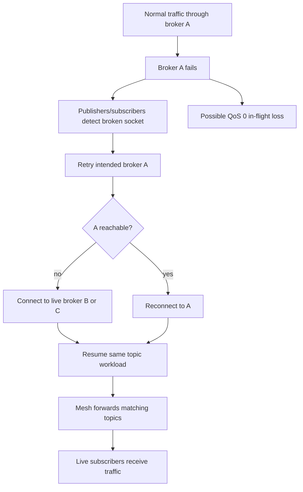
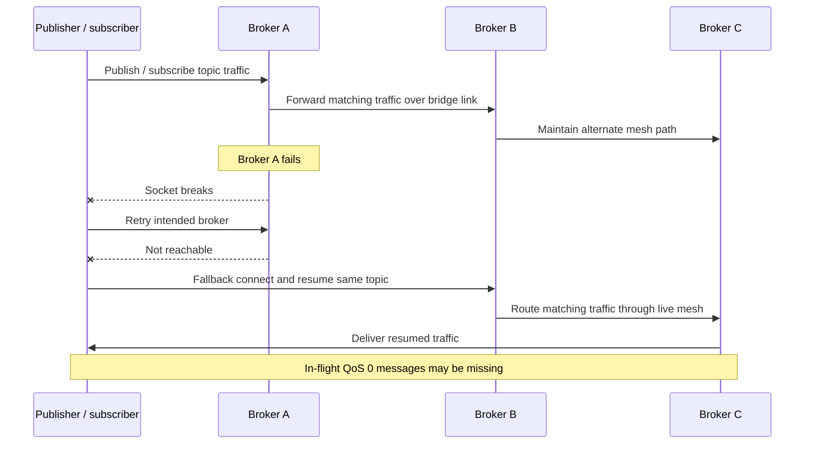

# mqtt_field_bridge_app

Product application for configurable MQTT field bridge deployments.

## Overview

`mqtt_field_bridge_app` composes the pinned Dephy modules into a deployable
ESP32 field bridge product. The current product path is Ethernet-first: the app
brings up W5500 Ethernet, applies saved product configuration, starts the local
MQTT broker, and applies manually configured static P2P bridge peers.

Provisioning is UART CLI based. Each node starts a local MQTT broker and uses
static P2P bridge peers to forward matching topic traffic across the mesh.
MQTT clients can publish or subscribe through any reachable broker.



The older embedded provisioning web UI is no longer part of the firmware build
path; web-related Linux helpers remain only for local test and compatibility
work.

## Quick Start

```sh
git clone git@github.com:judadao/mqtt_field_bridge_app.git
cd mqtt_field_bridge_app
./scripts/setup.sh
```

For setup options, firmware builds, local module development, and test commands,
see `docs/setup.md`.


## What This Repo Owns

This repo owns the product application, build composition, and product-level
tests. For setup, build, and test details, see `docs/setup.md` and
`tests/linux/README.md`.

## Load-Balance Throughput Results

Summary of the latest benchmark claims. Full setup, logs, and column details
are in `docs/load_balance_throughput_results.md`.

### 1. Single Broker Speed

Raw single-node broker throughput with 8 clients on one topic.

| Case | Client layout A/B/C/D | Topic count | Msg/s | Delivery |
|------|----------------------:|------------:|------:|---------:|
| mosquitto | `8/0/0/0` | `1` | `28,618.2` | `100.0%` |
| field no-fallback | `8/0/0/0` | `1` | `28,599.0` | `100.0%` |

Result: field broker throughput matches mosquitto for this workload.

### 2. Fixed Message Broker Failure Recovery

Three brokers each send 700,000 fixed messages, which produced roughly
three-minute cases on the Linux benchmark host. A random node's primary broker
listener is stopped 60s after publishing starts, held down for 10s, then
restarted. The fallback case retries that same node's primary broker port first,
then connects to that same node's mesh-only fallback ingress port.

Random single-broker failure, seed `270701`, selected broker A.

| Case | Dropped | Elapsed | Sent A/B/C | Received A/B/C | Fallback pub/sub | Missing | Delivery |
|------|--------:|--------:|-----------:|----------------:|-----------------:|--------:|---------:|
| mosquitto | `A` | `182.455s` | `231024/700000/700000` | `231023/368009/367995` | `0/0/0 / 0/0/0` | `1132973` | `46.0489%` |
| field no-fallback | `A` | `182.781s` | `230836/700000/700000` | `230836/354003/353956` | `0/0/0 / 0/0/0` | `1161205` | `44.7045%` |
| field fallback | `A` | `184.411s` | `700000/700000/700000` | `698837/699999/699999` | `1/0/0 / 1/0/0` | `1165` | `99.9445%` |

Random two-broker failure, seed `270702`, selected brokers A/C.

| Case | Dropped | Elapsed | Sent A/B/C | Received A/B/C | Fallback pub/sub | Missing | Delivery |
|------|--------:|--------:|-----------:|----------------:|-----------------:|--------:|---------:|
| mosquitto | `A/C` | `182.392s` | `230181/700000/230186` | `230180/368529/230185` | `0/0/0 / 0/0/0` | `1271106` | `39.4711%` |
| field no-fallback | `A/C` | `181.781s` | `230530/700000/230454` | `230530/354425/230454` | `0/0/0 / 0/0/0` | `1284591` | `38.829%` |
| field fallback | `A/C` | `185.194s` | `700000/700000/700000` | `698841/699999/698844` | `1/0/1 / 1/0/1` | `2316` | `99.8897%` |

Result: fallback reconnects affected publishers and subscribers through the
mesh-only fallback ingress port on the failed node(s), completes every publisher
target, and keeps end-to-end delivery above 99.88% under one- and two-node
primary broker listener failures.

### 3. Client Limit Balance

A is full at 8 clients; 18 new subscribers try A first.

| Case | Clients A/B/C/D | Rejected burst subs | Received | Msg/s |
|------|----------------:|--------------------:|---------:|------:|
| field no-fallback | `8/2/2/2` | `18` | `163,861` | `8,193.05` |
| field fallback | `8/8/8/8` | `0` | `536,816` | `26,840.8` |

Result: fallback spreads clients across B/C/D instead of rejecting the burst.

### 4. Topic Subscription Limit Balance

A topic table is full; 36 new topic subscribers try A first.

| Case | Topic subs | Topics A/B/C/D | Rejected burst subs | Received | Msg/s | Delivery |
|------|-----------:|----------------:|--------------------:|---------:|------:|---------:|
| field no-fallback | `28` | `16/4/4/4` | `36` | `10,976` | `548.8` | `70.0%` |
| field fallback | `64` | `16/16/16/16` | `0` | `35,805` | `1,790.25` | `100.0%` |

Result: fallback uses spare topic-table capacity on B/C/D and accepts all 64
topic subscriptions.


## Mesh Example

This four-node example uses a ring plus one diagonal seed so every node has a
short path into the mesh. A subscriber on node D can receive a topic published
through node A because the broker mesh forwards the matching subscription path.



Example peer slots:

| Node | Peer 0 | Peer 1 |
|------|--------|--------|
| A | B `192.168.127.16:4884` | C `192.168.127.17:4884` |
| B | C `192.168.127.17:4884` | A `192.168.127.15:4884` |
| C | D `192.168.127.18:4884` | A `192.168.127.15:4884` |
| D | A `192.168.127.15:4884` | C `192.168.127.17:4884` |

## Recovery Process

Recovery uses client fallback and mesh routing. If a broker fails, affected
clients retry it first, then connect to another live broker and continue the
same topics. QoS 0 messages already in flight at the failure boundary can be
lost.



## Three-Node Recovery Sequence

When broker A fails, its clients fall back to a live broker and keep using the
same topics. The mesh carries resumed traffic through the remaining nodes.



## Results And Historical Notes

Detailed load-balance, fallback, and failure-recovery benchmark records live in
`docs/load_balance_throughput_results.md`. Older README material and removed
web/WiFi provisioning notes are kept in `docs/readme_legacy.md` and related
documents for reference.

## Repository Layout

See `docs/setup.md` for build entry points and the `Docs` section below for
project notes, validation records, and historical references.

## Docs

- `tests/linux/README.md`: Linux test inventory, knobs, benchmark commands, and
  hardware-test notes.
- `docs/setup.md`: setup wrapper, dependency commands, firmware build, and test
  commands.
- `docs/field_bridge_scenario.md`: field bridge scenario notes.
- `docs/field_validation_checklist.md`: hardware validation checklist.
- `docs/hardware_wifi_validation.md`: WiFi validation notes for test profiles.
- `docs/load_balance_throughput_results.md`: recorded benchmark results.
- `docs/versioning.md`: dependency/version guidance.
- `docs/readme_legacy.md`: previous long README and historical examples.

## Principle

This repo owns product workflow and module composition. If behavior is reusable,
fix it in the module repo first, tag it, then update `deps.json`.

## License

MIT. See `LICENSE` and `NOTICE.md`.
