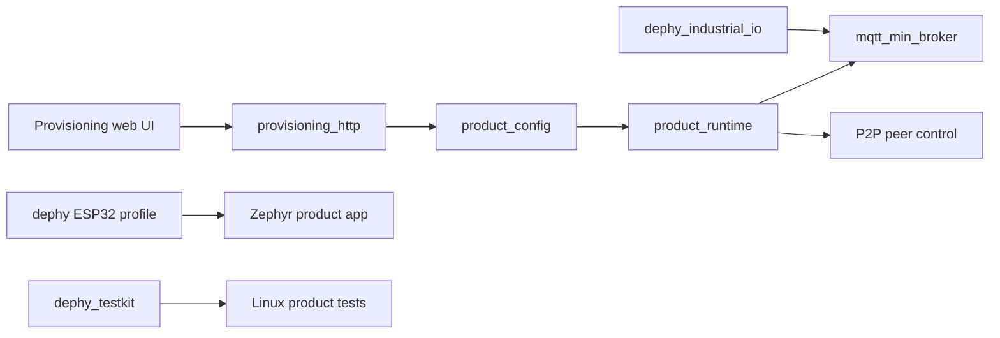
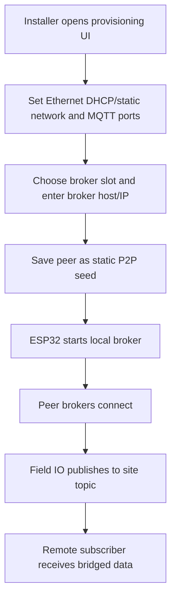

# mqtt_field_bridge_app

Product application for configurable MQTT field bridge deployments.

## Quick Start: Linux Web UI

```sh
git clone git@github.com:judadao/mqtt_field_bridge_app.git
cd mqtt_field_bridge_app
./run_linux_web.sh
```

Open `http://127.0.0.1:8080/`. The Ethernet provisioning UI loads directly;
there is no login step.

This starts the product provisioning UI on Linux. It is the fastest way to see
and test the web flow before using ESP32 hardware.

## Overview

`mqtt_field_bridge_app` composes Dephy modules into a deployable ESP32 field
bridge. It owns provisioning UI/HTTP APIs, product configuration, Ethernet
network setup, manual broker peer selection, runtime status, and product-level
Linux tests.

## Key Value

- Product integration of `mqtt_min_broker`, `dephy`, `dephy_industrial_io`, and
  `dephy_testkit`.
- Embedded provisioning UI for Ethernet network settings, MQTT/P2P broker
  controls, and manual broker peer config.
- Static-seed P2P product path using `CONFIG_MQTT_P2P_DYNAMIC=y` and
  `CONFIG_MQTT_P2P_STATIC_SEEDS_ONLY=y`.
- Linux web runner and tests for config, provisioning rendering, peer application, runtime
  status, sync deps, and reconnect stress.
- Keeps reusable broker/IO/board behavior in module repos instead of product
  source.

## Linux Commands

```sh
# Fast local validation
make -C tests/linux unit-tests

# Full Linux product tests, including P2P scenarios and stress tests
make -C tests/linux test
```

`run_linux_web.sh` uses sibling module checkouts when they exist. Otherwise it
downloads the pinned dependency versions into `deps/`.

## Load-Balance Throughput Results

The benchmark records four separate claims. Detailed logs are in
`docs/load_balance_throughput_results.md`.

### 1. Single Broker Speed

Test condition:
- One broker is active; all 8 MQTT clients connect to broker A.
- Workload is 4 publishers, 4 subscribers, and 1 topic for 20 seconds.
- This checks raw broker speed, not fallback.

| Case | Client layout A/B/C/D | Topic count | Msg/s | Delivery |
|------|----------------------:|------------:|------:|---------:|
| mosquitto | `8/0/0/0` | `1` | `28,618.2` | `100.0%` |
| field no-fallback | `8/0/0/0` | `1` | `28,599.0` | `100.0%` |

Result: the field broker is effectively equal to mosquitto for this single-node
workload.

### 2. Fixed Message Broker Failure Recovery

Test condition:
- Four brokers: A, B, C, D.
- Each broker owns one local publisher/subscriber pair.
- Each publisher attempts exactly 10,000 messages, so the fixed expected total
  is 40,000 received messages.
- The random seed selects both failure count and broker identities. In the
  recorded run, three brokers are terminated 0.5s after publishing starts, held
  down for 3s, then restarted.
- Mosquitto and field no-fallback do not reconnect failed-broker clients.
- Field fallback reconnects failed-broker clients to a live broker and continues
  the remaining fixed publish/receive workload.

Column meanings:
- `Sent`: messages the publisher managed to send before completion or failure.
- `Received`: unique payloads received by the matching subscriber.
- `Dropped workload`: received messages for the failed brokers only, so recovery
  is not hidden by healthy broker traffic.
- `Pub done`: whether each broker's publisher reached 10,000 messages.
- `Delivery`: received messages divided by the fixed expected 40,000.

| Case | Dropped | Expected A/B/C/D | Sent A/B/C/D | Received A/B/C/D | Dropped workload | Pub done A/B/C/D | Missing | Delivery |
|------|--------:|-----------------:|-------------:|------------------:|-----------------:|-----------------:|--------:|---------:|
| mosquitto | `A/B/D` | `10000/10000/10000/10000` | `1932/1932/10000/1938` | `1931/1931/10000/1937` | `5799/30000` | `0/0/1/0` | `24201` | `39.4975%` |
| field no-fallback | `A/B/D` | `10000/10000/10000/10000` | `1924/1929/10000/1934` | `1923/1928/10000/1933` | `5784/30000` | `0/0/1/0` | `24216` | `39.46%` |
| field fallback | `A/B/D` | `10000/10000/10000/10000` | `10000/10000/10000/10000` | `9998/9999/10000/9999` | `29996/30000` | `1/1/1/1` | `4` | `99.99%` |

Result: the fixed-message test shows the active failure behavior directly.
Without fallback, publishers on failed brokers stop when their connections are
cut and do not complete their 10,000-message targets. With fallback, those
publishers and subscribers reconnect through live brokers and complete all but
four QoS 0 messages from the fixed 40,000-message workload.

The recovery happens at the client path, not through durable broker replay. When
A/B/D fail, their publishers and subscribers see broken sockets. With fallback
enabled they retry their intended broker first, then connect to a remaining live
broker and continue using the same logical topics. The field broker mesh can then
carry that workload through the live node. The four missing messages are expected
QoS 0 loss around the failure boundary: packets already in flight when the socket
breaks are not persisted and replayed.

### 3. Client Limit Balance

Test condition:
- Four field brokers: A, B, C, D.
- Client admission limit is 8 clients per broker.
- Topic count is 1, so topic capacity is not the limit.
- Preload: A has 7 subscribers and 1 publisher, so A is full at 8 clients.
  B/C/D each have 2 subscribers.
- Burst: 18 new subscribers all try broker A first.

Column meanings:
- `Clients A/B/C/D`: total connected clients on each broker after the burst.
- `Rejected burst subs`: burst subscribers that could not connect anywhere.
- `Received`: delivered messages during the 20-second run.

| Case | Clients A/B/C/D | Rejected burst subs | Received | Msg/s |
|------|----------------:|--------------------:|---------:|------:|
| field no-fallback | `8/2/2/2` | `18` | `163,861` | `8,193.05` |
| field fallback | `8/8/8/8` | `0` | `536,816` | `26,840.8` |

Result: fallback uses the spare client capacity on B/C/D. The same burst that is
rejected without fallback is accepted and served with fallback.

### 4. Topic Subscription Limit Balance

Test condition:
- Four field brokers: A, B, C, D.
- Client admission limit is 64 clients per broker, so client count is not the
  limit.
- Topic subscription table limit is 16 entries per broker.
- Test topic count is 64.
- Preload: A has 16 topic subscriptions, so A's topic table is full. B/C/D each
  have 4 topic subscriptions.
- Burst: 36 new topic subscribers all try broker A first.

Column meanings:
- `Topic subs`: accepted subscriber-topic registrations across all brokers.
- `Topics A/B/C/D`: accepted topic subscriptions on each broker.
- `Rejected burst subs`: burst subscribers rejected because no topic slot was
  available on the attempted broker path.

| Case | Topic subs | Topics A/B/C/D | Rejected burst subs | Received | Msg/s | Delivery |
|------|-----------:|----------------:|--------------------:|---------:|------:|---------:|
| field no-fallback | `28` | `16/4/4/4` | `36` | `10,976` | `548.8` | `70.0%` |
| field fallback | `64` | `16/16/16/16` | `0` | `35,805` | `1,790.25` | `100.0%` |

Result: fallback uses the spare topic-table capacity on B/C/D. Topic
subscriptions rise from 28 to 64, and the rejected burst drops from 36 to 0.

## ESP32 / Dephy Build

Use this path when you are ready to build firmware for the Dephy ESP32 target:

```sh
# Build from local sibling module checkouts
./scripts/sync_deps.sh local-build

# Or build from pinned git dependencies
./scripts/sync_deps.sh external-build
```

`local-build` is for multi-repo development under one workspace.
`external-build` is for a clean product build from `deps.json`.

## Architecture Flow



## Example User Scenario



## Simple Principle

This repo owns product workflow and module composition. If a behavior is
reusable, fix it in the module repo first, tag it, then update `deps.json`.

## Systematic Regression Testing

From the workspace root, run the shared pytest regression module:

```sh
../dephy_testkit/.venv/bin/python -m pytest ../dephy_testkit/tests/regression --module mqtt_field_bridge_app
../dephy_testkit/.venv/bin/python -m pytest ../dephy_testkit/tests/regression --module mqtt_field_bridge_app --profile integration
../dephy_testkit/.venv/bin/python -m pytest ../dephy_testkit/tests/regression --module mqtt_field_bridge_app --profile full
```

The local repo tests remain:

```sh
make -C tests/linux unit-tests provisioning-render-size
make -C tests/linux integration-tests
make -C tests/linux test
```

`make -C tests/linux test` is the canonical local entry point and triggers the
main suites through `dephy_testkit` using `tests/linux/trigger_testkit.sh`.
When a test case or test script changes, update the direct Makefile target and
the matching `testkit-*` wrapper so regression and CI runs keep using testkit
result reporting.

## Docs

- `docs/readme_legacy.md`: previous long README and detailed examples.
- `docs/field_bridge_scenario.md`: field bridge scenario notes.
- `docs/field_validation_checklist.md`: hardware validation checklist.
- `docs/bridge_wifi_join_plan.md`: legacy Bridge WiFi join plan.
- `docs/versioning.md`: dependency/version guidance.
- `docs/todo.md`: current TODO summary.

## License

MIT. See `LICENSE` and `NOTICE.md`. Reuse and references are allowed, but the
copyright notice and attribution to Judd (judadao) must be preserved.
