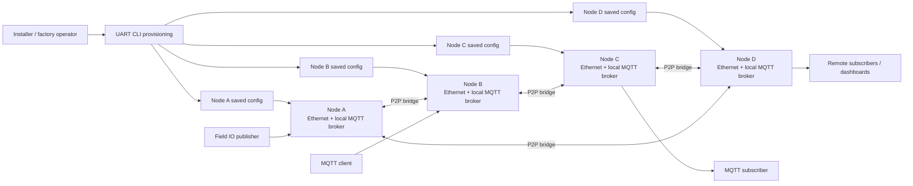
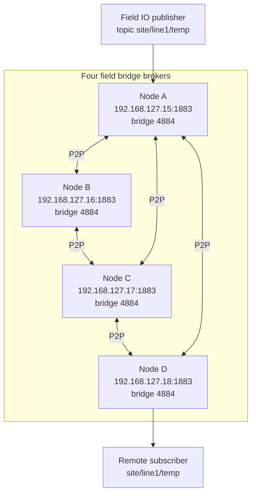
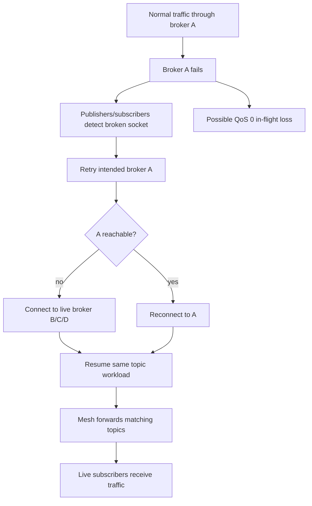
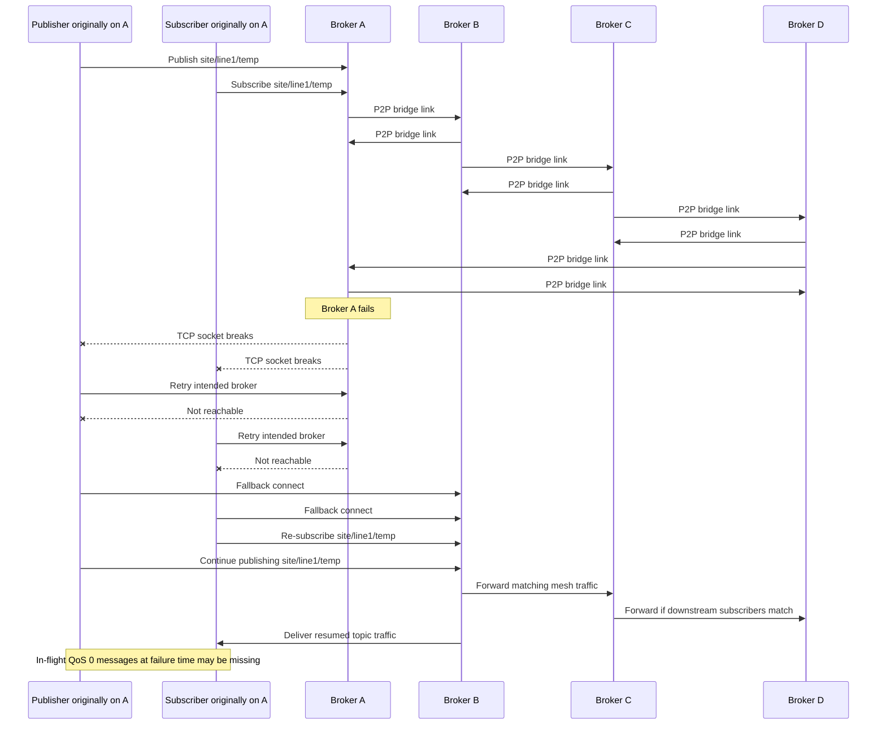

# mqtt_field_bridge_app

Product application for configurable MQTT field bridge deployments.

## Overview

`mqtt_field_bridge_app` composes the pinned Dephy modules into a deployable
ESP32 field bridge product. The current product path is Ethernet-first: the app
brings up W5500 Ethernet, applies saved product configuration, starts the local
MQTT broker, and applies manually configured static P2P bridge peers.

The firmware provisioning path is UART CLI based. The older embedded
provisioning web UI is no longer part of the firmware build path; web-related
Linux helpers are kept only for local test and compatibility work.

## What This Repo Owns

- Product configuration defaults and persistence glue.
- UART CLI menus and commands for device network, local broker, and peer bridge
  settings.
- Ethernet startup and runtime status handling for the product firmware.
- Static-seed MQTT/P2P bridge control using `CONFIG_MQTT_P2P_DYNAMIC=y` and
  `CONFIG_MQTT_P2P_STATIC_SEEDS_ONLY=y`.
- Linux host tests for product config, runtime behavior, CLI, IO bridge glue,
  dependency sync, P2P routing, and stress scenarios.
- Product build composition from pinned dependencies in `deps.json`.

Reusable broker, board, IO, network, config, and CLI behavior belongs in the
module repos. Product builds consume those modules from `deps/`.

## Repository Layout

```text
app/                 Zephyr product application
app/src/             Product C sources and headers
app/prj.conf         Default Ethernet firmware configuration
app/prj_wifi_linux_ap.conf
                     WiFi/Linux AP test-profile overlay
scripts/             Dependency sync, product build, and hardware helpers
tests/linux/         Linux unit, integration, stress, benchmark, and HW tests
docs/                Project notes, validation records, and historical results
deps.json            Pinned dependency versions and build metadata
```

## Quick Start

```sh
git clone git@github.com:judadao/mqtt_field_bridge_app.git
cd mqtt_field_bridge_app
./scripts/setup.sh
```

For setup options, firmware builds, local module development, and test commands,
see `docs/setup.md`.

## Load-Balance Throughput Results

The benchmark records four separate claims. Detailed logs are in
`docs/load_balance_throughput_results.md`.

### 1. Single Broker Speed

Test condition:
- One broker is active; all 8 MQTT clients connect to broker A.
- Workload is 4 publishers, 4 subscribers, and 1 topic for 20 seconds.
- This checks raw broker speed, not fallback.

| Case | Client layout A/B/C/D | Topic count | Msg/s | Delivery |
|------|----------------------:|------------:|------:|---------:|
| mosquitto | `8/0/0/0` | `1` | `28,618.2` | `100.0%` |
| field no-fallback | `8/0/0/0` | `1` | `28,599.0` | `100.0%` |

Result: the field broker is effectively equal to mosquitto for this single-node
workload.

### 2. Fixed Message Broker Failure Recovery

Test condition:
- Four brokers: A, B, C, D.
- Each broker owns one local publisher/subscriber pair.
- Each publisher attempts exactly 10,000 messages, so the fixed expected total
  is 40,000 received messages.
- The random seed selects both failure count and broker identities. In the
  recorded run, three brokers are terminated 0.5s after publishing starts, held
  down for 3s, then restarted.
- Mosquitto and field no-fallback do not reconnect failed-broker clients.
- Field fallback reconnects failed-broker clients to a live broker and continues
  the remaining fixed publish/receive workload.

Column meanings:
- `Sent`: messages the publisher managed to send before completion or failure.
- `Received`: unique payloads received by the matching subscriber.
- `Dropped workload`: received messages for the failed brokers only, so recovery
  is not hidden by healthy broker traffic.
- `Pub done`: whether each broker's publisher reached 10,000 messages.
- `Delivery`: received messages divided by the fixed expected 40,000.

| Case | Dropped | Expected A/B/C/D | Sent A/B/C/D | Received A/B/C/D | Dropped workload | Pub done A/B/C/D | Missing | Delivery |
|------|--------:|-----------------:|-------------:|------------------:|-----------------:|-----------------:|--------:|---------:|
| mosquitto | `A/B/D` | `10000/10000/10000/10000` | `1932/1932/10000/1938` | `1931/1931/10000/1937` | `5799/30000` | `0/0/1/0` | `24201` | `39.4975%` |
| field no-fallback | `A/B/D` | `10000/10000/10000/10000` | `1924/1929/10000/1934` | `1923/1928/10000/1933` | `5784/30000` | `0/0/1/0` | `24216` | `39.46%` |
| field fallback | `A/B/D` | `10000/10000/10000/10000` | `10000/10000/10000/10000` | `9998/9999/10000/9999` | `29996/30000` | `1/1/1/1` | `4` | `99.99%` |

Result: the fixed-message test shows the active failure behavior directly.
Without fallback, publishers on failed brokers stop when their connections are
cut and do not complete their 10,000-message targets. With fallback, those
publishers and subscribers reconnect through live brokers and complete all but
four QoS 0 messages from the fixed 40,000-message workload.

The recovery happens at the client path, not through durable broker replay. When
A/B/D fail, their publishers and subscribers see broken sockets. With fallback
enabled they retry their intended broker first, then connect to a remaining live
broker and continue using the same logical topics. The field broker mesh can then
carry that workload through the live node. The four missing messages are expected
QoS 0 loss around the failure boundary: packets already in flight when the socket
breaks are not persisted and replayed.

### 3. Client Limit Balance

Test condition:
- Four field brokers: A, B, C, D.
- Client admission limit is 8 clients per broker.
- Topic count is 1, so topic capacity is not the limit.
- Preload: A has 7 subscribers and 1 publisher, so A is full at 8 clients.
  B/C/D each have 2 subscribers.
- Burst: 18 new subscribers all try broker A first.

Column meanings:
- `Clients A/B/C/D`: total connected clients on each broker after the burst.
- `Rejected burst subs`: burst subscribers that could not connect anywhere.
- `Received`: delivered messages during the 20-second run.

| Case | Clients A/B/C/D | Rejected burst subs | Received | Msg/s |
|------|----------------:|--------------------:|---------:|------:|
| field no-fallback | `8/2/2/2` | `18` | `163,861` | `8,193.05` |
| field fallback | `8/8/8/8` | `0` | `536,816` | `26,840.8` |

Result: fallback uses the spare client capacity on B/C/D. The same burst that is
rejected without fallback is accepted and served with fallback.

### 4. Topic Subscription Limit Balance

Test condition:
- Four field brokers: A, B, C, D.
- Client admission limit is 64 clients per broker, so client count is not the
  limit.
- Topic subscription table limit is 16 entries per broker.
- Test topic count is 64.
- Preload: A has 16 topic subscriptions, so A's topic table is full. B/C/D each
  have 4 topic subscriptions.
- Burst: 36 new topic subscribers all try broker A first.

Column meanings:
- `Topic subs`: accepted subscriber-topic registrations across all brokers.
- `Topics A/B/C/D`: accepted topic subscriptions on each broker.
- `Rejected burst subs`: burst subscribers rejected because no topic slot was
  available on the attempted broker path.

| Case | Topic subs | Topics A/B/C/D | Rejected burst subs | Received | Msg/s | Delivery |
|------|-----------:|----------------:|--------------------:|---------:|------:|---------:|
| field no-fallback | `28` | `16/4/4/4` | `36` | `10,976` | `548.8` | `70.0%` |
| field fallback | `64` | `16/16/16/16` | `0` | `35,805` | `1,790.25` | `100.0%` |

Result: fallback uses the spare topic-table capacity on B/C/D. Topic
subscriptions rise from 28 to 64, and the rejected burst drops from 36 to 0.

## Architecture Flow

The product runtime is a static-seed MQTT broker mesh. UART CLI provisioning
saves each node's local network, local broker, and peer bridge settings. On
boot, each ESP32 starts its local broker and opens P2P bridge links to the saved
peer list. MQTT clients publish and subscribe to any reachable broker; the mesh
then forwards matching topic traffic across broker links.



In plain terms:
- Each node owns one local MQTT broker and one saved static peer list.
- Static peer seeds form the initial mesh; the broker module handles P2P topic
  forwarding after links are up.
- Publishers and subscribers can attach to different brokers while keeping the
  same logical MQTT topics.
- Linux tests exercise the same product config, runtime, peer filtering, and
  routing logic without ESP32 hardware.

## Mesh Example

This four-node example uses a ring plus one diagonal seed so every node has a
short path into the mesh. A subscriber on node D can receive a topic published
through node A because the broker mesh forwards the matching subscription path.



Example peer slots:

| Node | Peer 0 | Peer 1 |
|------|--------|--------|
| A | B `192.168.127.16:4884` | C `192.168.127.17:4884` |
| B | C `192.168.127.17:4884` | A `192.168.127.15:4884` |
| C | D `192.168.127.18:4884` | A `192.168.127.15:4884` |
| D | A `192.168.127.15:4884` | C `192.168.127.17:4884` |

## Recovery Process

Recovery is client-path fallback plus mesh routing, not durable broker replay.
When a broker fails, clients connected to that broker lose their TCP sockets.
Fallback clients retry their intended broker first, then connect to another live
broker. After reconnect, they keep publishing or subscribing to the same logical
topics, and the live broker mesh carries matching traffic through the remaining
nodes. QoS 0 packets already in flight at the failure boundary can still be
lost.



## Four-Node Recovery Sequence

This sequence matches the benchmark behavior: four brokers A/B/C/D are running,
broker A fails, affected clients reconnect to live broker B, and B/C/D continue
carrying the same topic workload through the mesh. The same process applies when
multiple brokers fail as long as at least one fallback target remains reachable.



## Results And Historical Notes

Detailed load-balance, fallback, and failure-recovery benchmark records live in
`docs/load_balance_throughput_results.md`. Older README material and removed
web/WiFi provisioning notes are kept in `docs/readme_legacy.md` and related
documents for reference.

## Docs

- `tests/linux/README.md`: Linux test inventory, knobs, benchmark commands, and
  hardware-test notes.
- `docs/setup.md`: setup wrapper, dependency commands, firmware build, and test
  commands.
- `docs/field_bridge_scenario.md`: field bridge scenario notes.
- `docs/field_validation_checklist.md`: hardware validation checklist.
- `docs/hardware_wifi_validation.md`: WiFi validation notes for test profiles.
- `docs/load_balance_throughput_results.md`: recorded benchmark results.
- `docs/versioning.md`: dependency/version guidance.
- `docs/readme_legacy.md`: previous long README and historical examples.

## Principle

This repo owns product workflow and module composition. If behavior is reusable,
fix it in the module repo first, tag it, then update `deps.json`.

## License

MIT. See `LICENSE` and `NOTICE.md`.
