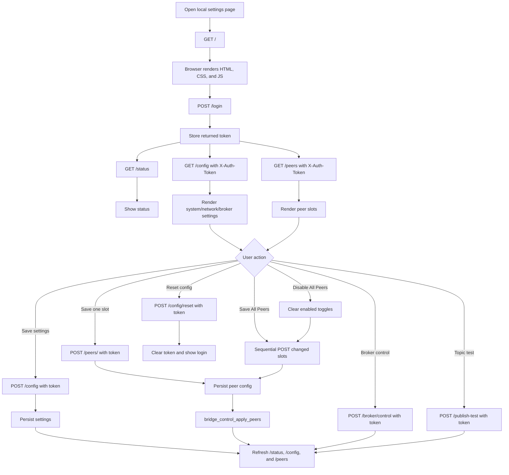
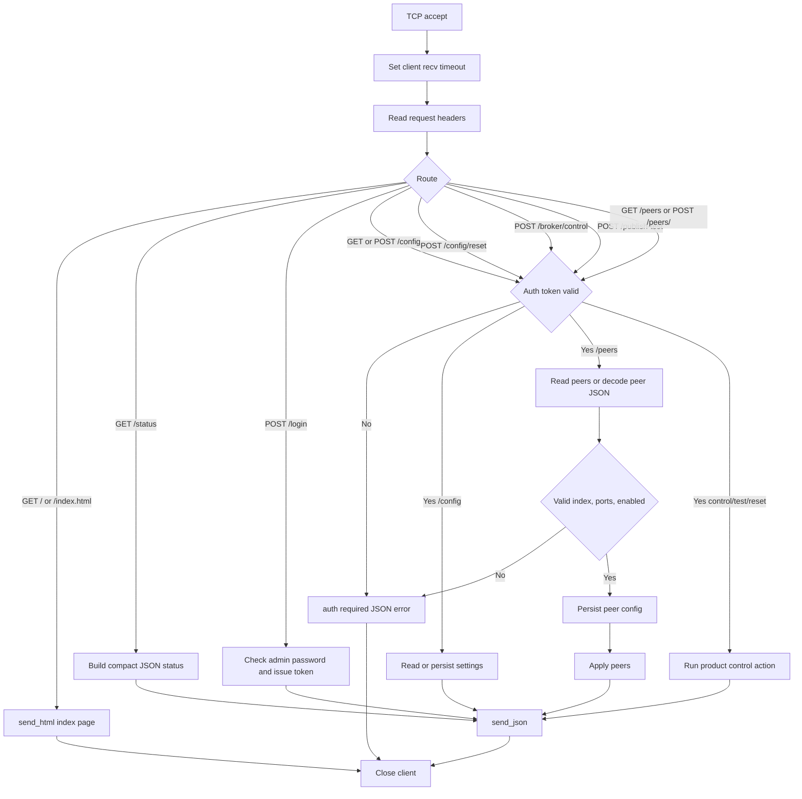

# mqtt_field_bridge_app

Product application for configurable MQTT field bridge scenarios.

This repository consumes `mqtt_min_broker` as a pinned dependency under
`deps/mqtt_min_broker`. Product builds should use the broker version declared in
`deps.json`, not a floating local checkout.

Current pinned broker release: `minmqtt-v0.1.12`.

## What This App Does

`mqtt_field_bridge_app` is the product layer around `mqtt_min_broker` for a
field-deployed MQTT mesh. The first validation setup uses three ESP32-class
nodes, but the product config is sized for larger peer lists:

- One or more edge nodes receive or produce field data.
- Multiple peer nodes subscribe to that data through broker-to-broker P2P routing.
- Each node keeps a local MQTT broker available, so local clients can continue
  to publish or subscribe even when another field node is temporarily offline.
- The product peer table defaults to 10 slots and can be raised at build time
  with `FIELD_BRIDGE_PEER_MAX` if the target has enough memory and flash.
- Broker nodes do not need to form a full mesh. If node 1 bridges to node 2 and
  node 3 bridges to node 2, all three are expected to behave as one connected
  broker network through node 2.

The broker dependency handles MQTT packet parsing, sessions, topic matching,
P2P discovery, and inter-node routing. This product app owns the field-specific
configuration, startup order, local provisioning/control endpoints, and topic
workflow decisions.

## Usage Scenarios

- Field telemetry bridge: publish field data on one node and route matching
  subscriptions to any reachable peer node over the P2P broker network.
- Local-first operation: keep local MQTT delivery working while peer nodes are
  offline, rebooting, or reconnecting.
- Site staging and provisioning: configure peer host/IP, MQTT port, P2P port,
  and enabled state through product-owned config APIs before field deployment.
- Broker dependency release validation: pin a broker tag in `deps.json`, sync it
  into `deps/mqtt_min_broker`, and run the Linux suite before building firmware.
- Hardware bring-up preparation: exercise product config, peer application, HTTP
  endpoints, and broker mesh behavior on Linux before moving to ESP32 boards.

## Why This Split Is Useful

- Reproducible builds: the broker version is pinned in `deps.json`, so product
  builds do not silently pick up whatever local broker checkout happens to exist.
- Clean ownership: product-specific WiFi setup, field workflow, and local UI
  stay here; reusable MQTT broker logic stays in `mqtt_min_broker`.
- Linux-first validation: most product behavior can be tested without hardware,
  including peer persistence, HTTP provisioning endpoints, three-node routing,
  reconnect recovery, and throughput stress.
- Safer broker upgrades: dependency sync refuses dirty broker checkouts and
  verifies that the pinned tag exists before checkout.
- Offline-tolerant field behavior: tests cover local delivery while a peer node
  is offline and recovery after peer restart.
- Scalable peer configuration: the local settings page and JSON API expose all
  configured peer slots, so 10-broker lab and field setups do not need a UI
  redesign or full-mesh peer wiring.

## Repo Layout

```text
mqtt_field_bridge_app/
├── deps.json
├── deps/
│   └── mqtt_min_broker/
├── app/
│   ├── CMakeLists.txt
│   ├── prj.conf
│   └── src/
├── scripts/
│   ├── sync_deps.sh
│   └── build_product.sh
└── docs/
    └── field_bridge_scenario.md
```

## Quick Start

1. Sync dependencies:

   ```bash
   ./scripts/sync_deps.sh
   ```

   Check whether a newer broker release is available:

   ```bash
   ./scripts/sync_deps.sh --check-latest
   ```

2. Build the product app:

   ```bash
   ./scripts/build_product.sh
   ```

3. Run Linux tests:

   ```bash
   make -C tests/linux test
   ```

The product app owns WiFi provisioning, local HTML UI, bridge peer
configuration, and the topic bridge workflow. The broker implementation remains
inside `deps/mqtt_min_broker`.

## Linux Development

Linux tests compile product modules with a small Zephyr logging shim. This is
the fastest path for day-to-day validation:

```bash
# Unit tests only
make -C tests/linux unit-tests

# Broker dependency sync and chain-topology routing scenario
make -C tests/linux integration-tests

# Reconnect and throughput stress tests
make -C tests/linux stress

# Everything
make -C tests/linux test
```

Useful knobs:

- `SETTLE_SEC=5`: P2P mesh settle time for integration and stress tests.
- `RESTART_COUNT=5`: number of B2 restart cycles in reconnect stress; set
  `RESTART_COUNT=10` for a longer run.
- `VERIFY_TIMEOUT_SEC=5`: max wait for post-restart messages.
- `PUB_COUNT=5`, `SUB_COUNT=3`, `DURATION=10`: throughput stress load.
- `MIN_THROUGHPUT_MSG=500`: minimum aggregate received messages required.

## Provisioning HTTP API

The current product HTTP server is intentionally small and focused on local
device provisioning: login, system settings, network settings, broker settings,
and bridge mesh peer slots.

```bash
# Status
curl http://127.0.0.1:8080/status

# Login with the default password and keep the token
TOKEN=$(curl -s -X POST http://127.0.0.1:8080/login \
  -H 'Content-Type: application/json' \
  -d '{"password":"admin"}' | sed -n 's/.*"token":"\([^"]*\)".*/\1/p')

# Read system, network, and broker settings
curl http://127.0.0.1:8080/config \
  -H "X-Auth-Token: $TOKEN"

# Save system, network, and broker settings
curl -X POST http://127.0.0.1:8080/config \
  -H "X-Auth-Token: $TOKEN" \
  -H 'Content-Type: application/json' \
  -d '{"device_name":"node-a","admin_password":"admin","wifi_ssid":"plant","wifi_password":"wifi-pass","ap_ssid":"ESP32-Min-Broker","ap_password":"12345678","device_ip":"192.168.4.1","gateway":"192.168.4.1","netmask":"255.255.255.0","dhcp_enabled":1,"site_id":"field-a","topic_prefix":"site/field-a","mqtt_port":1883,"p2p_port":4884,"broker_enabled":1,"bridge_enabled":1,"mesh_enabled":1}'

# List configured peers and runtime peer states
curl http://127.0.0.1:8080/peers \
  -H "X-Auth-Token: $TOKEN"

curl http://127.0.0.1:8080/peer-status \
  -H "X-Auth-Token: $TOKEN"

# Configure peer slot 0
curl -X POST http://127.0.0.1:8080/peers/0 \
  -H "X-Auth-Token: $TOKEN" \
  -H 'Content-Type: application/json' \
  -d '{"name":"node2","host":"192.168.10.12","mqtt_port":1883,"p2p_port":4884,"enabled":1}'

# Request broker start/stop state from the product control plane
curl -X POST http://127.0.0.1:8080/broker/control \
  -H "X-Auth-Token: $TOKEN" \
  -H 'Content-Type: application/json' \
  -d '{"enabled":1}'

# Record a product-level publish test payload
curl -X POST http://127.0.0.1:8080/publish-test \
  -H "X-Auth-Token: $TOKEN" \
  -H 'Content-Type: application/json' \
  -d '{"topic":"site/field-a/test","payload":"hello","qos":0,"retain":0}'

# Reset settings and peer slots back to firmware defaults
curl -X POST http://127.0.0.1:8080/config/reset \
  -H "X-Auth-Token: $TOKEN"
```

Peer slots default to 10 entries. Updating a peer persists the peer config and
calls `bridge_control_apply_peers()`. `/config`, `/config/reset`,
`/broker/control`, `/publish-test`, `/peers`, and `/peer-status` require the
`X-Auth-Token` returned by `/login`; `/status` and the HTML page are public.

The same server also serves a local settings page:

```text
http://<device-ip>:8080/
```

The page starts with a login form. After login, it loads the same JSON API and
shows three setting tabs:

- `System Setting`: device name and admin password.
- `Network Setting`: WiFi client values, setup AP values, default device IP,
  gateway, netmask, and DHCP toggle.
- `Broker Setting`: MQTT/P2P ports, site/topic fields, broker/bridge/mesh
  toggles, and bridge peer slots.
- `Topic Test`: topic, payload, QoS, and retain fields for a product-level test
  publish payload.

UI workflow:

1. Connect to the ESP32 min broker WiFi/AP or the same LAN.
2. Open `http://<device-ip>:8080/`. The default setup IP is `192.168.4.1`.
3. Login with the admin password. The firmware default is `admin`.
4. Edit `System Setting`, `Network Setting`, or `Broker Setting`.
5. For each bridge peer, set:
   - `Name`: local label for the peer.
   - `Host / IP`: peer broker address.
   - `MQTT Port`: peer MQTT listener port.
   - `P2P Port`: peer bridge/P2P listener port.
   - `Enabled`: whether this peer should be applied.
6. Press `Save` on one slot to persist only that peer.
7. Press `Save All Peers` after editing multiple slots. The page compares each row
   with the last loaded values and only sends changed slots.
8. Press `Disable All Peers` to clear every enabled toggle and persist the disabled
   state only for slots that changed.
9. Press `Start Broker` or `Stop Broker` to request broker control state.
10. Use `Topic Test` to record a test topic/payload through the provisioning API.
11. Press `Reset Config` to restore defaults, clear peers, and require login again.

The raw status panel shows the latest JSON returned by the device, which is
useful during field setup and debugging.

Browser-to-device operation flow:



UI action mapping:

| UI action | HTTP/API flow | Program flow | Notes |
|-----------|---------------|--------------|-------|
| Open settings page | `GET /` or `GET /index.html` | `handle_client` -> `send_html` | Static page is served from firmware; no external assets. |
| Login | `POST /login` | Password check -> issue token | The page stores the token and sends it as `X-Auth-Token`. |
| Refresh | `GET /status`, then authenticated `GET /config` and `GET /peers` | `handle_get_status`, `handle_get_config`, `handle_get_peers` | Updates status cards, settings forms, peer slots, and raw JSON panel. |
| Save settings | Authenticated `POST /config` | Decode JSON -> `product_config_set_settings` | Persists system, network, and broker settings. |
| Save one slot | Authenticated `POST /peers/<index>` | Decode JSON -> `product_config_set_peer` -> `bridge_control_apply_peers` | Persists one peer and reapplies active peers. |
| Save All Peers | Sequential authenticated `POST /peers/<index>` only for changed rows | Same as single-slot save for each changed row | Dirty-save reduces flash writes, HTTP requests, and peer reapply work. |
| Disable one slot | `POST /peers/<index>` with `enabled:0` | Persist disabled peer -> reapply peers | Keeps host and port values for later reuse. |
| Disable All Peers | Clear enabled toggles, then Save All Peers | Sequential disabled writes only for changed rows -> reapply peers | Fast field recovery path when isolating a node without rewriting already-disabled slots. |
| Broker control | Authenticated `POST /broker/control` | `product_runtime_set_broker_enabled` | Records requested control state; true live stop still requires broker dependency lifecycle support. |
| Topic test | Authenticated `POST /publish-test` | Validate and record test payload | Provides a provisioning/API path for field topic test input. |
| Reset config | Authenticated `POST /config/reset` | Clear peers -> restore defaults -> clear token | Field recovery path; user logs in again with the default password. |

Provisioning HTTP program flow:



## Topic Model

The intended topic family is:

```text
site/<site_id>/<stream>
```

Planned streams:

- `status`: device and field status.
- `io`: field IO payloads.
- `event`: field events and alarms.

The Linux integration tests exercise the topic routing shape with topics such as
`site/field-a/data/io` and wildcard subscribers on `site/field-a/data/#`, using
a chain topology rather than a full mesh.

## Current Status

Implemented in this product repo:

- Pinned broker dependency sync through `deps.json` and `scripts/sync_deps.sh`.
- Broker dependency updated to `minmqtt-v0.1.12`, which includes parser-level
  malformed packet hardening.
- Linux stress tests rebuild broker binaries after dependency changes and keep
  reconnect cycles conservative by default; use `RESTART_COUNT=10` for a longer
  reconnect run.
- Validated system, network, broker, and peer config storage, with Linux file
  persistence and Zephyr NVS persistence path.
- Field recovery reset path that clears peer slots, restores defaults, and
  invalidates the current login token.
- Small and large deployment default profiles for field setup.
- Product topic helpers for `status`, `io`, `event`, and `test` streams under
  the configured topic prefix.
- Bridge peer apply logic that validates enabled peers before handing them to
  the broker/P2P layer.
- Enabled IPv4 bridge peers are applied to the broker static seed table, so
  peer changes can be re-applied without rebooting the product app.
- Peer runtime state is exposed through `/peer-status` as `disabled`,
  `connecting`, `connected`, `disconnected`, or `unknown` with a last-error
  field.
- Product-owned provisioning HTTP server with `/status`, `/login`, `/config`,
  `/config/reset`, `/broker/control`, `/publish-test`, `/peers`,
  `/peer-status`, and
  `POST /peers/<index>` endpoints.
- Firmware-served HTML settings page with login, System Setting, Network
  Setting, Broker Setting / Bridge Mesh Setting, runtime status cards, broker
  control buttons, reset, and Topic Test.
- Linux HTTP/web unit tests for page content, login token flow, authenticated
  settings APIs, authenticated peer APIs, broker control, publish test, reset,
  and invalid request paths.
- Linux unit, integration, reconnect stress, and throughput stress tests under
  `tests/linux/`.

Still open:

- Zephyr `west build` confirmation is blocked in this workspace because `west`
  and `ZEPHYR_BASE` are not installed.
- Product network startup and board overlays for target ESP32 hardware are
  blocked until the exact ESP32 board target and flash partition requirements
  are selected.
- Applying saved WiFi/network settings to the target ESP32 networking driver.
- Live broker stop/restart after boot; current broker dependency exposes a
  blocking run loop but no stop lifecycle API.
- WiFi reconnect hardware validation.

## Latest Test Result

Last verified locally on 2026-06-19 with:

```bash
make -C tests/linux test
make -C tests/linux scale-tests
make -C tests/linux scale-ring-tests
```

Result:

- `unit_product_config`: 216/216 checks passed.
- `unit_product_runtime`: 54/54 checks passed.
- `unit_product_topics`: 20/20 checks passed.
- `unit_bridge_control`: 12/12 tests passed.
- `unit_provisioning_http`: 159/159 checks passed.
- `test_sync_deps.sh`: 11 passed, 0 failed.
- `test_3node_scenario.sh`: 4 passed, 0 failed.
- `stress_reconnect.sh`: 5 restart cycles passed; B1 survived all cycles.
- `stress_throughput.sh`: 2,355,212 messages received in 10 seconds
  (`235,521 msg/s`), above the 500-message minimum; all three brokers survived.
- `test_chain_scale.sh`: 10-node chain passed; B10 received a B1 publish
  through the connected bridge graph and all 10 brokers survived.
- `TOPOLOGY=ring test_chain_scale.sh`: 10-node ring passed with the same
  first-node to last-node delivery and all 10 brokers survived.

## Release And Tagging

Product releases use `bridge-vX.Y.Z` tags. Broker dependency releases use
`minmqtt-vX.Y.Z` tags in the `mqtt_min_broker` repository and are referenced by
`deps.json`.

Current product release tag in this branch:

```text
bridge-v0.1.4
```

## Dependency Rule

Update `deps.json` only after `mqtt_min_broker` has a new released tag.
Temporary fixes under `deps/mqtt_min_broker` should be upstreamed to the broker
repo and replaced by a tag bump.

## Product TODO

The execution TODO list is in [`docs/todo.md`](docs/todo.md).
Manual field validation steps are in
[`docs/field_validation_checklist.md`](docs/field_validation_checklist.md).

Version and tag naming rules are in [`docs/versioning.md`](docs/versioning.md).
