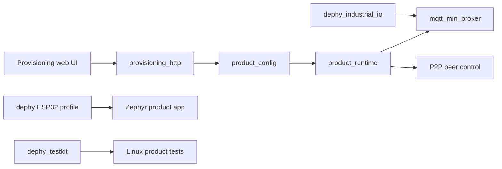
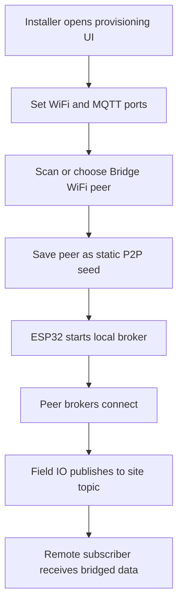

# mqtt_field_bridge_app

Product application for configurable MQTT field bridge deployments.

## Overview

`mqtt_field_bridge_app` composes Dephy modules into a deployable ESP32 field
bridge. It owns provisioning UI/HTTP APIs, product configuration, Bridge WiFi,
peer selection, runtime status, and product-level Linux tests.

## Key Value

- Product integration of `mqtt_min_broker`, `dephy`, `dephy_industrial_io`, and
  `dephy_testkit`.
- Embedded provisioning UI for network, MQTT, P2P, Bridge WiFi, and peer config.
- Static-seed P2P product path using `CONFIG_MQTT_P2P_DYNAMIC=y` and
  `CONFIG_MQTT_P2P_STATIC_SEEDS_ONLY=y`.
- Linux tests for config, provisioning rendering, peer application, runtime
  status, sync deps, and reconnect stress.
- Keeps reusable broker/IO/board behavior in module repos instead of product
  source.

## How To Use

```sh
./scripts/sync_deps.sh download
./scripts/sync_deps.sh replace
./scripts/sync_deps.sh init
./scripts/build_product.sh
make -C tests/linux test
```

Use `replace` during local multi-repo development so sibling module checkouts
are copied into `deps/`.

## Architecture Flow



## Example User Scenario



## Simple Principle

This repo owns product workflow and module composition. If a behavior is
reusable, fix it in the module repo first, tag it, then update `deps.json`.

## Docs

- `docs/readme_legacy.md`: previous long README and detailed examples.
- `docs/field_bridge_scenario.md`: field bridge scenario notes.
- `docs/field_validation_checklist.md`: hardware validation checklist.
- `docs/bridge_wifi_join_plan.md`: Bridge WiFi join plan.
- `docs/versioning.md`: dependency/version guidance.
- `docs/todo.md`: current TODO summary.

## License

MIT. See `LICENSE` and `NOTICE.md`. Reuse and references are allowed, but the
copyright notice and attribution to Judd (judadao) must be preserved.
