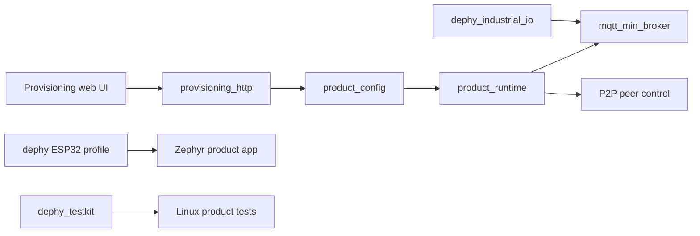
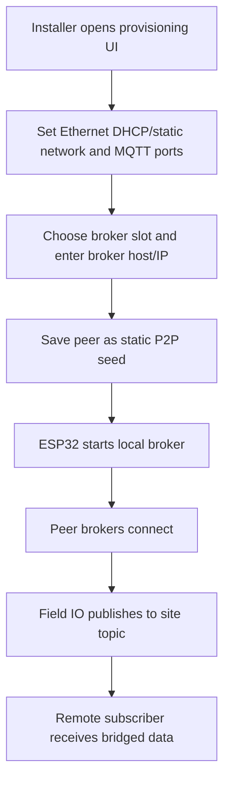

# mqtt_field_bridge_app

Product application for configurable MQTT field bridge deployments.

## Quick Start: Linux Web UI

```sh
git clone git@github.com:judadao/mqtt_field_bridge_app.git
cd mqtt_field_bridge_app
./run_linux_web.sh
```

Open `http://127.0.0.1:8080/`. The Ethernet provisioning UI loads directly;
there is no login step.

This starts the product provisioning UI on Linux. It is the fastest way to see
and test the web flow before using ESP32 hardware.

## Overview

`mqtt_field_bridge_app` composes Dephy modules into a deployable ESP32 field
bridge. It owns provisioning UI/HTTP APIs, product configuration, Ethernet
network setup, manual broker peer selection, runtime status, and product-level
Linux tests.

## Key Value

- Product integration of `mqtt_min_broker`, `dephy`, `dephy_industrial_io`, and
  `dephy_testkit`.
- Embedded provisioning UI for Ethernet network settings, MQTT/P2P broker
  controls, and manual broker peer config.
- Static-seed P2P product path using `CONFIG_MQTT_P2P_DYNAMIC=y` and
  `CONFIG_MQTT_P2P_STATIC_SEEDS_ONLY=y`.
- Linux web runner and tests for config, provisioning rendering, peer application, runtime
  status, sync deps, and reconnect stress.
- Keeps reusable broker/IO/board behavior in module repos instead of product
  source.

## Linux Commands

```sh
# Fast local validation
make -C tests/linux unit-tests

# Full Linux product tests, including P2P scenarios and stress tests
make -C tests/linux test
```

`run_linux_web.sh` uses sibling module checkouts when they exist. Otherwise it
downloads the pinned dependency versions into `deps/`.

## ESP32 / Dephy Build

Use this path when you are ready to build firmware for the Dephy ESP32 target:

```sh
# Build from local sibling module checkouts
./scripts/sync_deps.sh local-build

# Or build from pinned git dependencies
./scripts/sync_deps.sh external-build
```

`local-build` is for multi-repo development under one workspace.
`external-build` is for a clean product build from `deps.json`.

## Architecture Flow



## Example User Scenario



## Simple Principle

This repo owns product workflow and module composition. If a behavior is
reusable, fix it in the module repo first, tag it, then update `deps.json`.

## Systematic Regression Testing

From the workspace root, run the shared pytest regression module:

```sh
../dephy_testkit/.venv/bin/python -m pytest ../dephy_testkit/tests/regression --module mqtt_field_bridge_app
../dephy_testkit/.venv/bin/python -m pytest ../dephy_testkit/tests/regression --module mqtt_field_bridge_app --profile integration
../dephy_testkit/.venv/bin/python -m pytest ../dephy_testkit/tests/regression --module mqtt_field_bridge_app --profile full
```

The local repo tests remain:

```sh
make -C tests/linux unit-tests provisioning-render-size
make -C tests/linux integration-tests
make -C tests/linux test
```

`make -C tests/linux test` is the canonical local entry point and triggers the
main suites through `dephy_testkit` using `tests/linux/trigger_testkit.sh`.
When a test case or test script changes, update the direct Makefile target and
the matching `testkit-*` wrapper so regression and CI runs keep using testkit
result reporting.

## Docs

- `docs/readme_legacy.md`: previous long README and detailed examples.
- `docs/field_bridge_scenario.md`: field bridge scenario notes.
- `docs/field_validation_checklist.md`: hardware validation checklist.
- `docs/bridge_wifi_join_plan.md`: legacy Bridge WiFi join plan.
- `docs/versioning.md`: dependency/version guidance.
- `docs/todo.md`: current TODO summary.

## License

MIT. See `LICENSE` and `NOTICE.md`. Reuse and references are allowed, but the
copyright notice and attribution to Judd (judadao) must be preserved.
